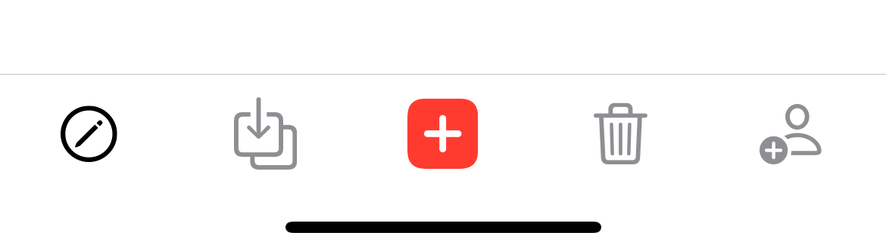
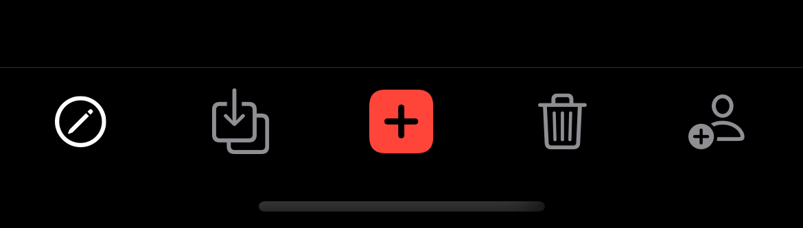

# SwiftUI Custom TabBar

Custom tabbar with modal presentation created in SwiftUI.

# Menu
* [Screenshots](#screenshots)
* [Source](#source)
* [Contributions](#contributions)
* [Contact](#contact)

# Screenshots

* Light mode:

* Dark mode: 

# Source
Concept reference: [Lets Build That App](https://www.youtube.com/channel/UCuP2vJ6kRutQBfRmdcI92mA), fully developed with SwiftUI.

# Contributions

* All kinds of contributions (enhancements, new features, documentation & code improvements, issues & bugs reporting & todo task) are welcome. Let's make it better.

# Contact
Created by [Terry Kuo](https://twitter.com/ArgonYoYo) - feel free to contact me!
